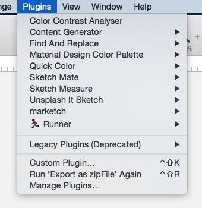

# How-to-enter-the-sketch-workflow
> 本篇主要讲：如何从ps工作模式过渡到sketch工作流下，实现团队合作，提升整体效率

# sketch工作流遇到的问题以及如何解决
## 一、软件安装
sketch的安装很简单，下载好安装包后双击即可按照流程很顺利的完成安装，一般不会有什么问题。
> 小提示：sketch激活可以去某宝买或者去这个帖子下面找最新的源文件：<a href="http://www.jianshu.com/p/3590f089e500" target="_blank">sketch各个破解版下载</a> 

## 二、前期准备
### 1）插件选择
由于sketch具有很高的可扩展性，开始工作前安装一些必备的插件是可以大幅度提高工作效率的。插件安装神器：<a href="http://sketchtoolbox.com">Sketch Toolbox</a>   
> Tips:其实直接用sketch自带的插件管理工具也是很方便的，在官网的插件库和github上都可以找到最新的插件包。

下面介绍一些我在工作过程中常用的插件：

具体插件有什么用处，怎么使用，请参照资料或者自行谷歌 
资料：<a href="https://www.zhihu.com/question/27495264 ">Sketch 有哪些插件值得推荐？</a>
根据自己的需要下载

- <a href="https://github.com/zifeixu85/Better-Sketch">github开源项目优秀插件收集</a>
- <a href="https://github.com/JJYing/Fake-Chinese-Name-for-Sketch">生成随机中文名插件</a>

### 2）快捷键学习
sketch在使用过程中，记住一些常用的快捷键是很有必要的。当然，不嫌麻烦的话也可以自定义快捷，改回跟PS一样的快捷键。

* <a href="http://www.ui.cn/detail/17479.html">常用快捷键介绍</a>
* <a href="http://www.zcool.com.cn/article/ZNDA5ODI0.html">如何自定义快捷键</a>

### 3）基本的软件知识学习
* <a href="https://zhuanlan.zhihu.com/p/21359496">教程1：一些技巧，插件介绍</a>
* <a href="https://maimai.cn/article/detail?fid=77633319&from=single_feed&share_user=http%253A%252F%252Fi9.taou.com%252Fmaimai%252Fp%252F2074%252F2965_90_b2usF19sYi8xzi-a160 ">教程2：一些技巧学习</a>
* <a href="http://www.ui.cn/detail/157249.html ">教程3：sketch工作前可以提高效率的准备工作</a>
* <a href="http://www.ui.cn/detail/31273.html">教程4：学习资料汇总贴</a>

## 三、新建文件
### 1、sketch新建画布默认尺寸比平时PS新建的尺寸小？

sketch现在鼓励一倍图的设计，所以更改了初始模板的尺寸。使用一倍图设计，优点就是占资源小，文件小，方便生成多倍图！

## 四、设计过程中遇到的问题以及如何解决（保持更新）
> Tips:我的<a href="http://caiyunsky.me">个人博客</a>中会更新一些工作中遇到的问题以及解决方案，欢迎关注。

### 1、字体行高问题
sketch文本属性spacing中的Line是指文本的实际高度，测试发现会比size小，比如这里是14size，实际文本占的高度是10.
实际设计标注中，不要去掉文字的外框，因为在系统默认字体苹方或者思源体的情况下，这个外框正好是开发那边文本控件的高度。
### 2、使用Sketch设计时，中英文混排时如何设置字体？
通过插件先设置好默认使用的字体，然后通过插件修改段落中英文的字体。
我更常用的方式是选择需要修改的字体直接修改就好了。
如果是在symbol中有中英文混排，则相对比较麻烦，目前只有修改电脑使用字体才可以（不建议这么做，最好不要使用中文混排的symbol） 
<a href="https://www.zhihu.com/question/26534333 ">问题资料</a>

### 3、Sketch 使用时，如何在选中对象或者对象组时，在画板内用鼠标拖动对象，而不会误点到上层的对象？
* 1）左侧选中一个或多个编组，右侧检查器中取消勾选“Click-through when selecting”。
* 2）当元素很小，不好选择时，可以按住command键，鼠标拖动框选来选择元素。
* 3）使用command键选中要移动的元素后，同时按住option+command拖动元素即可。

### 4、使用UI设计工具Sketch如何解决色彩管理、矢量图形绘制等具体问题？
* 1）色彩管理：
   Sketch导入图片和导出图片，色彩会发生变化。问题来源是修改了电脑本身的颜色模式。改回默认的颜色模式即可解决！
* 2）矢量图绘制
   个人觉得，复杂一些的矢量绘制，建议在AI里绘制好复制到Sketch。
   一些简单的图形，可以直接在sketch里进行绘制。后期熟练掌握sketch布尔运算后一样可以直接进行复杂图标的设计。 
   <a href="https://www.zhihu.com/question/24072939">问题资料</a>

### 5、Sketch钢笔工具画完的路径如何闭合？
用sketch的钢笔工具画形状的时候，画了一次按esc退出后，又想把路径闭合成一个完整的形状，怎么才能闭合路径呢？

 

选择这个形状按Enter，然后点击close Path

### 6、带阴影图标，怎么确定导出切图后的大小？
把带有阴影的部分成组，然后选中组，按S，点一下这个组就会自动导出带有阴影部分的切图。如果手动切图，就需要把XY轴的偏移量补偿回去。

### 7、sketch如何解决0.1像素误差这种事情？
路径模式下，选择右上角的round to fluu pixels edges 

### 8、sketch设计UI中字体尺寸包含空白如何准确对齐？ 
默认字体苹方或者思源黑体的情况下，保留空白区域标注，因为程序那边开发写出来的代码，文本控件也是有空白区域的,其他字体需要单独调整 
<a href="https://www.zhihu.com/question/26758579">问题资料</a>
### 9、sketch如何复制样式？
Command + Option + C ( V )

### 10、在AI中画好图标后，导出会出现样式丢失或者其他异常情况？

在AI中画好图标，应该使用存储为svg格式，不用AI2017版本里的导出svg命令即可解决问题（AI2017版本中的svg导出功能有BUG，会导致导出的图标是空白的）。

## 五、切图，标注
### 1、Mac上用Sketch做的设计产出如何与还使用PC做前端开发的工程师（前端来切图）进行无缝对接？
用好切图标注软件，文件的设计，图层的划分，文本层等，交给开发那边一份zeplin或者Marketch生成的html标注页面。 
<a href="https://www.zhihu.com/question/36318532">问题资料</a>
### 2、界面设计中的文字还原问题 

请见：<a href="https://zhuanlan.zhihu.com/p/21813824">解决方案</a>
### 3、用sketch切图时，导出的png会自动去掉透明区域，怎样保留透明区域的空间？ 
* 1） 建立切片区域Slice，并且和需要导出的内容放到一个组里面 
    
* 2）勾选仅导出组内容 
    

* 3）确认和去掉画布背景颜色选项中的Include Export，很多时候带底色，就是因为你默认选上了导出的时候带上了背景色( Include Export ) 
    
* 4）设置好尺寸然后导出。

### 4、sketch 导出图片模糊不清，不知道如何解决？ 
主要是苹果的高清屏导致的问题。实际图片被放大了2倍造成看起来模糊，实际上是没问题的。
### 5、如何使用 Sketch 生成 Webfont？
请见：<a href="https://zhuanlan.zhihu.com/p/19748558">解决方案</a> 
### 6、sketch文字外围的边框能不能调整成贴合文字，如果不能，是不是用sketch measure标注出来的间距都是不准的？ 
这涉及到设计和开发沟通中常见的一个问题——行高影响。
在一些非标准控件中，会涉及到自定义的间距之类的。这个时候，我们给出的是「视觉间距」，因为我们不能预估开发时这个文字对应的行高（也不可能要求开发全部设定为 1em，要被打死）。

开发看的时候，会把视觉间距换算为开发用的间距。看下面的例子：

定义 L = 标注的视觉距离；
定义 a = 某文字元素的字号；
定义 b = 此文字的行高； 

那么在开发的时候，可以这么计算：

实际距离 = L - (b-a)/2

比如标注了距离是 20pt，行高 1.5，字号 16pt，那么开发需要设定实际间距就是 15pt。 

<a href="https://www.zhihu.com/question/25528295">问题资料</a>

### 7.批量导出问题

问题重现：每次导出资源时，如果是要导出多种尺寸，都需要重复设置导出参数，这样很不方便，能不能保存导出设置？

解决办法：

- 方法1：下载一个<a href="https://github.com/abynim/sketch-exportable ">保存预设插件</a>可以保存预设

- 方法2：先做好全部要切的资源，然后全选所有切片，设置一次导出设置，将资源导出。

- 方法3：下载插件<a href="https://github.com/Ashung/Android_Res_Export/blob/master/README_zh.md ">导出插件</a>，配合这个插件来实现导出

### 8、导出png图片有背景

单独导出png图片，需要建组，然后对组进行切片。

## 六、团队协作(保持更新)
自从sketch更新出了symbols后，团队协作能力就大大增强了，但是随之而来的问题也变得很多，总结了一些坑，协作过程中需要多加注意。
> Tips:我的<a href="http://caiyunsky.me">个人博客</a>中会更新一些团队合作中遇到的问题以及解决方案，欢迎关注。

1、保持自己的symbols库和团队共享的symbols不重复。

2、文字经常会出问题，把同类型的文字也建成symbol，这样如果文字出现不居中，换字体的情况都只需要修改这个文字symbol就可以。

3、在更新sketch文档时，直接把自己做的源文件拖到公共sketch组件中时，会发生设置好的属性文字丢失，图标丢失等等情况。解决办法是复制page里的页面到新的公共组件中，就可以保留设置好的属性值。

4、在导出资源的时候，还是要针对每一个需要导出的元素设置切片范围，这样才可以导出需要的资源。

5、设置切片时，需要将切片和被切片的元素放在一个组里面，再关闭Export Group Contents Only,要不然就会出现带背景的情况。

6、导出小技巧。在用sketch measure导出插件时，将自己需要导出的page放在最上面，这样可以方便自己找到需要导出的页面。

Tip:导出后，如果发现有问题，不要使用导出覆盖而是把之前有问题的文件夹全部删掉，重新导出一次。

7、每次迭代组件后，都需要检查下，是不是链接到迭代的共享组件，如果没有，需要单独调整。如果有在自己的组件库中发现与新更新的组件重复，则说明重复组件有更新过，需要重新选择新组件（老组件填的样式会保留,没有嵌套的情况），替换后删掉自己组件库中的重复组件。

8、命名规范：模块名――页面名字――控件名――状态。建议自己新建的模块symbols命名不要跟基础底层symbols命名规范一致，这样做是为了方便自己区分自己的symbol和共享的symbol。

9、文件更新时，会出现symbol属性丢失的情况，如何解决文件合并的问题？

1）symbols有重复且有嵌套symbol，则直接删除被创建的symbols页面中的重复symbol

2）symbols有重复且没有嵌套symbol，则先选择更新的symbols，之后再删除被创建的symbols页面中的重复symbol

3）最终的目标是更新的symbols和复制页面后被创建的symbols页面中的symbol都是唯一的。

Tip:用automate-sketch.sketchplugin插件找到哪些页面在使用这个symbols。

## 七、其他资料
### 1、专制处女座 之 Sketch
主要介绍一些文字标注方面的小知识。 
<a href="https://zhuanlan.zhihu.com/p/20594884">文字标注小知识</a>

### 2、sketch有那些提升工作效率的实用技巧？
这些小技巧很实用，推荐一看。 
<a href="https://www.zhihu.com/question/41362114">实用小技巧</a>

还不完善，欢迎补充，多谢！

